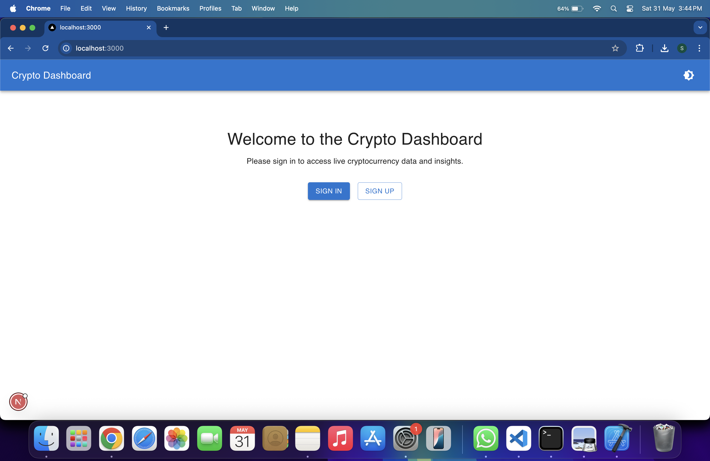
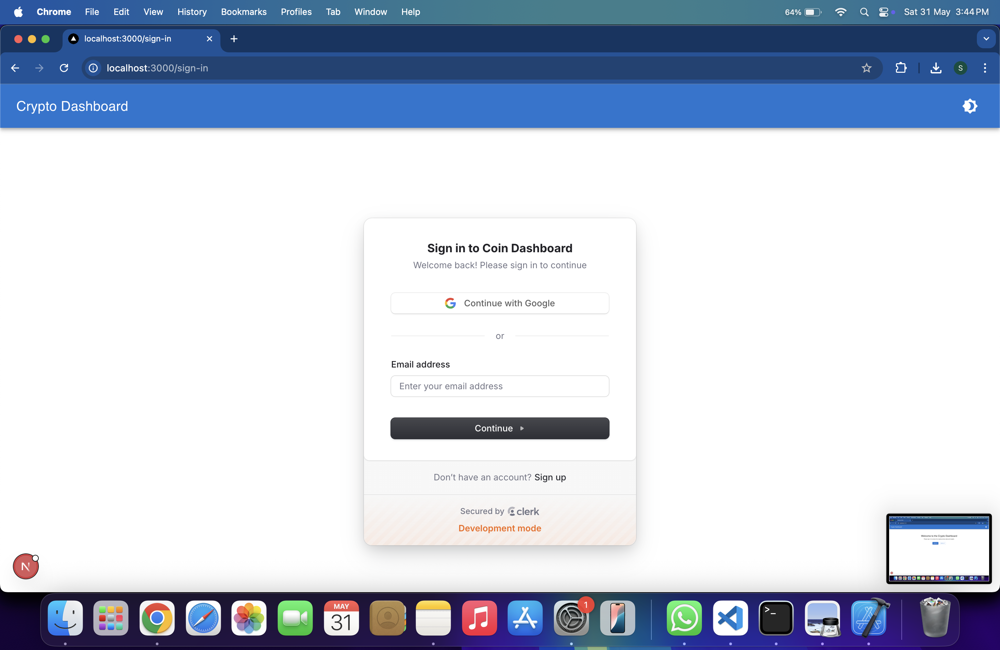
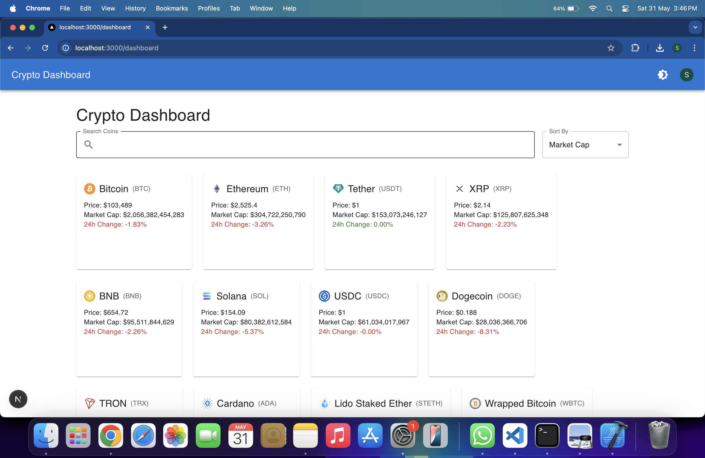
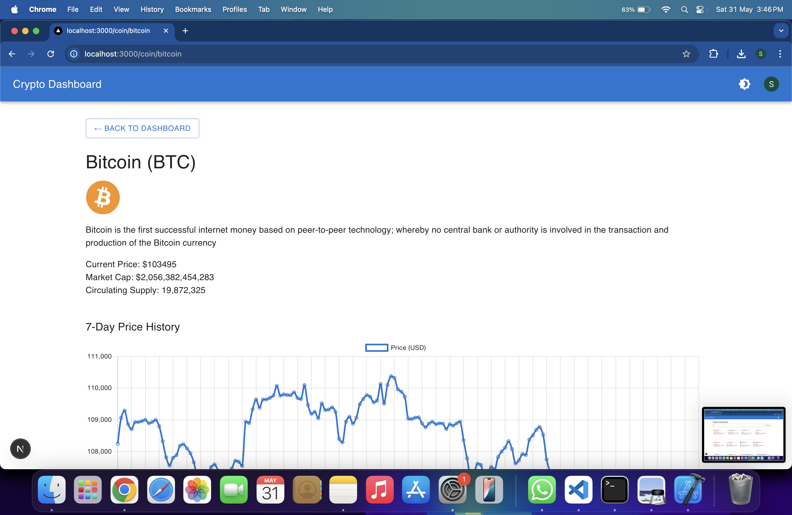
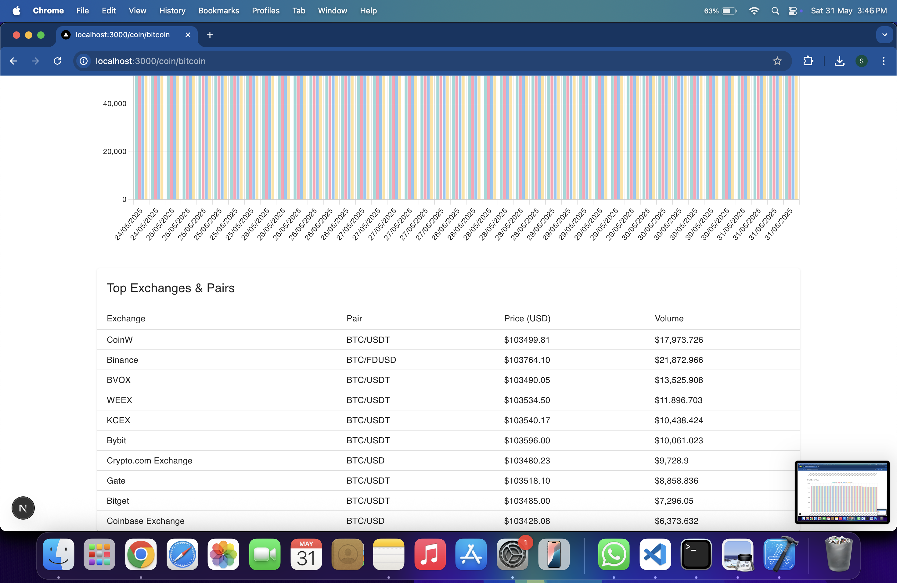

# 💰 Crypto Dashboard

A modern, responsive cryptocurrency dashboard built with **Next.js**, **Material UI**, **Clerk authentication**, **React Query**, and **Chart.js**. This project fetches and displays live crypto market data via the CoinGecko API.

---

## 🔗 Live Demo

**Coming Soon...**  
_Replace this with your deployed Vercel URL once live._

---

## 📂 Features

- ✅ Secure user authentication via **Clerk**
- ✅ Top 50 cryptocurrencies dashboard
- ✅ Live search and sorting
- ✅ Individual coin detail pages
- ✅ OHLC + 7-day charts (via **Chart.js**)
- ✅ Real-time ticker + market stats
- ✅ Light/dark theme toggle (MUI)
- ✅ Fully responsive across devices
- ✅ Auth-protected routes (`middleware.ts`)
- ✅ **Deployed on Vercel**

---

## 🚀 Tech Stack

- **Next.js 14** (App Router)
- **TypeScript**
- **Material UI**
- **Clerk** (authentication)
- **TanStack React Query** (data fetching & caching)
- **Chart.js** (`react-chartjs-2`)
- **CoinGecko API**
- **Vercel** (deployment)

---

## 🧠 Architecture

```
/
├── app/                  → App Router pages & layout
├── components/           → Reusable UI components
├── context/ThemeContext.tsx  → Theme management (dark/light)
├── lib/queries.ts        → Axios-based API queries
├── middleware.ts         → Route protection with Clerk
├── types/                → TypeScript interfaces/types
├── styles/               → Global and MUI theming
└── public/screenshots/   → Optional screenshots for README
```

---

## ⚙️ Getting Started

1. **Clone the repository**
   ```bash
   git clone https://github.com/your-username/crypto-dashboard.git
   cd crypto-dashboard
   ```

2. **Install dependencies**
   ```bash
   npm install
   ```

3. **Setup environment variables**

   Create a `.env.local` file:
   ```env
   NEXT_PUBLIC_API_BASE_URL=https://api.coingecko.com/api/v3
   NEXT_PUBLIC_CLERK_PUBLISHABLE_KEY=your_clerk_publishable_key
   CLERK_SECRET_KEY=your_clerk_secret_key
   ```

4. **Run the app**
   ```bash
   npm run dev
   ```

---

## ⚠️ API Rate Limit Note

> CoinGecko’s free API has strict rate limits.  
> Rapid requests (e.g., switching between multiple coin pages quickly) may trigger:

```
429 Too Many Requests
```

Although caching (`staleTime`) via React Query was tested, it still led to rate limits — so it was removed in favor of better handling and documentation.

---

## 🔐 Protected Routes

Pages like `/dashboard` and `/coin/[id]` are protected using **Clerk + `middleware.ts`**, ensuring only authenticated users can access them.

---

## 📸 Screenshots (Optional)

Place screenshots in `public/screenshots/` and reference them like:

```






```

---

## 🙋 Author

**Sana Ahmad**  
GitHub: [@your-username](https://github.com/your-username)

---

## 📄 License

This project is licensed under the [MIT License](LICENSE).
